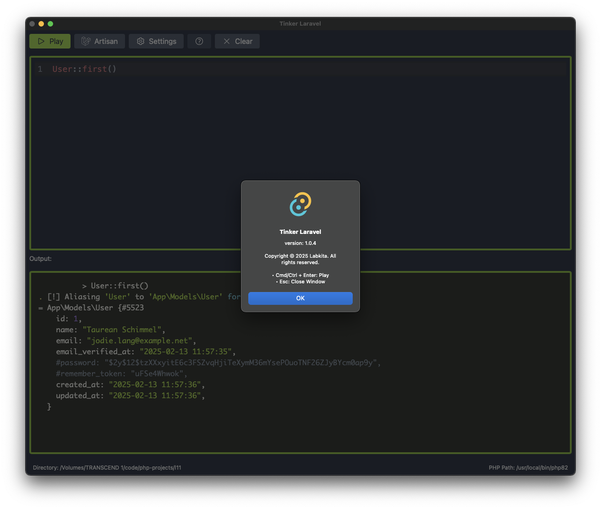

# Tinker Laravel Desktop App

This is a desktop app for tinker in laravel

Run your Laravel code directly from this desktop application

## Features

- run custom code like in `artisan tinker`
- run artisan command
- custom laravel directory
- custom php path

## Built with:

- tauri v2
- rust v1.77.2
- nodejs v18
- vue v3
- vite v6
- tailwindcss v3

## Screenshots

   

## Development

install bun

```bash
curl -fsSL https://bun.sh/install | bash
```

```bash
bun install
```

```bash
bun tauri dev
```

## Build

```bash
bun tauri build
```

check `src-tauri/target` folder for the build binary

## Security

If you discover any security related issues, please create an issue.

## License

The MIT License (MIT). Please see [License File](LICENSE.md) for more
information.
